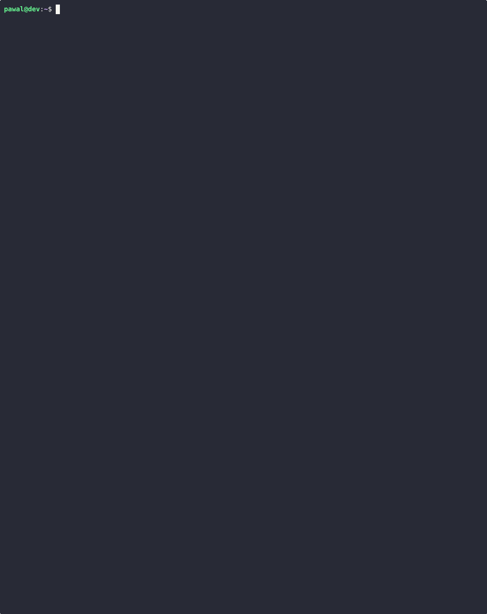
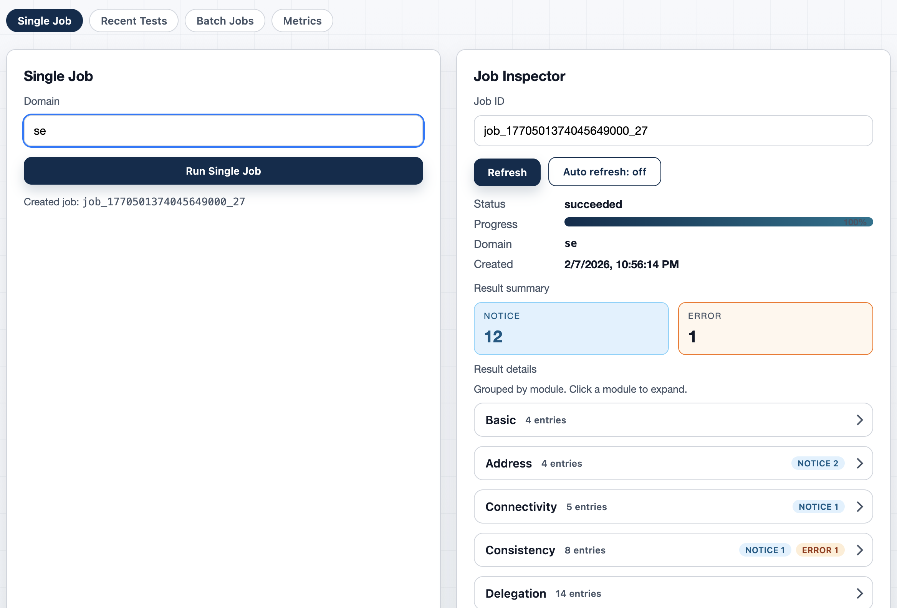
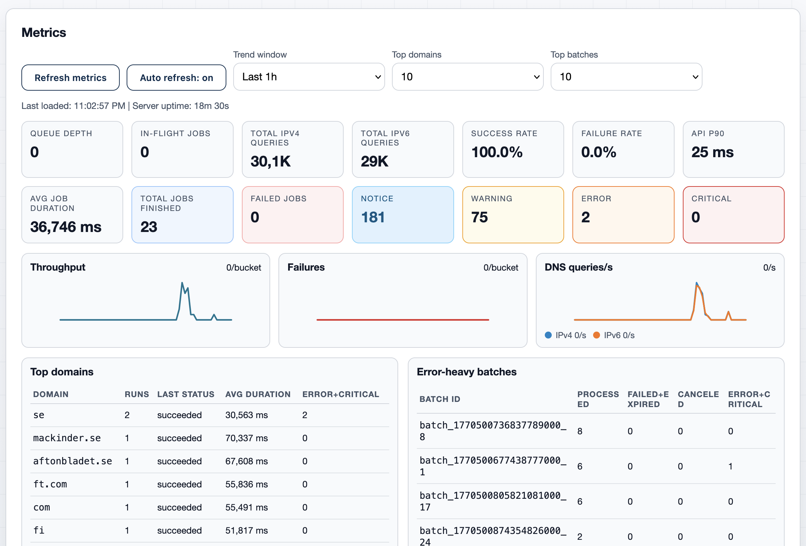

# Gonemaster

Gonemaster is a Go implementation of the Zonemaster DNS test engine, with a
local CLI, an HTTP server, a server automation client, and public analysis
views for tagged domain cohorts.

The Public UI is available here: https://gonemaster.evilbit.de/

## Common Paths

### Run One Local Test

```console
gonemaster example.com
gonemaster --json --domain example.com | jq
gonemaster --module dnssec --testcase dnssec01 example.com
```

Direct CLI documentation: [pawal.codeberg.page/gonemaster/cli](https://pawal.codeberg.page/gonemaster/cli/)

### Start the Server

```console
go build -o ./gonemaster-server ./cmd/gonemaster-server
./gonemaster-server
```

Server documentation: [pawal.codeberg.page/gonemaster/server](https://pawal.codeberg.page/gonemaster/server/)

### Automate the Server

```console
gonemaster-client jobs create --domain example.com --wait --view summary
gonemaster-client jobs batch --file domains.txt --tag tld --wait
gonemaster-client entries query --tag tld --module DNSSEC --latest
```

Client documentation: [pawal.codeberg.page/gonemaster/client](https://pawal.codeberg.page/gonemaster/client/)

### Publish Analysis Cohorts

```console
gonemaster-client tags create tld --description "Top-level domains"
gonemaster-client tags add-domains tld --file tlds.txt
gonemaster-client jobs batch --from-tag tld --tag tld --wait
```

Analysis documentation: [pawal.codeberg.page/gonemaster/analysis](https://pawal.codeberg.page/gonemaster/analysis/)

## Install

Install the local CLI:

```console
go install codeberg.org/pawal/gonemaster/cmd/gonemaster@latest
```

Build from source:

```console
git clone https://codeberg.org/pawal/gonemaster.git
cd gonemaster
make help
go test ./...
go build -o gonemaster ./cmd/gonemaster
sudo install -m 0755 gonemaster /usr/local/bin/gonemaster
```

The Makefile includes common targets such as `build`, `test`, `ui-build`, and
documentation/specification checks. Run `make help` for the current list.

## Documentation

Full documentation: [pawal.codeberg.page/gonemaster](https://pawal.codeberg.page/gonemaster/)

- [CLI](https://pawal.codeberg.page/gonemaster/cli/) - local test runner
- [Server](https://pawal.codeberg.page/gonemaster/server/) - HTTP server and queue
- [Client](https://pawal.codeberg.page/gonemaster/client/) - automation client
- [Analysis](https://pawal.codeberg.page/gonemaster/analysis/) - cohort analysis and snapshots
- [Specifications](https://pawal.codeberg.page/gonemaster/specifications/) - testcase and tag reference
- [OpenAPI](docs/openapi.yaml) - machine-readable API spec
- [pkg.go.dev](https://pkg.go.dev/codeberg.org/pawal/gonemaster/engine) - Go package docs; `engine` is the main entry point for embedding gonemaster programmatically

## Highlights

- Parallel-safe engine runs with per-run state isolation.
- Text, JSON, JSON stream, and raw log output.
- Undelegated testing with explicit nameserver and DS input.
- HTTP server with persistent queue, batches, tags, profiles, and metrics.
- Public API and public UI that avoid exposing internal job IDs.
- Public cohort analysis with immutable snapshots.
- Stored packet cache save/restore for reproducible runs.

## Screenshots

CLI output:



Admin UI:



Metrics view:


